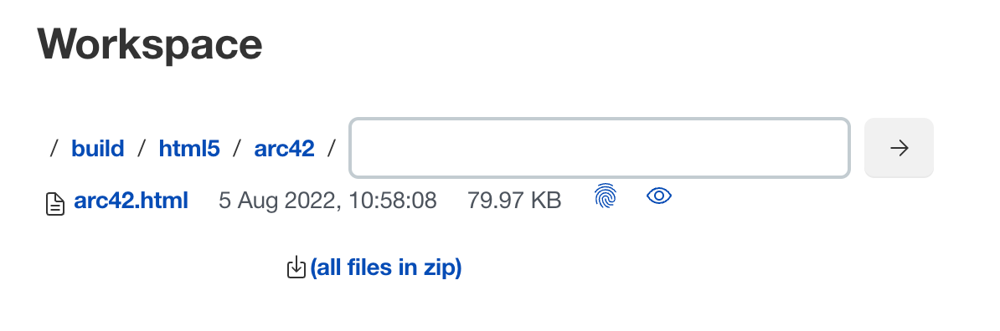

:icons: font
:toc: left

= CI-CD Demo

This repository demonstrates how to use docToolchain with misc. _Continuous Integration_ (CI) environments (aka. _Build Servers_)

== Gitlab

.`.gitlab-ci.yml`
[source,yaml]
----
include::.gitlab-ci.yml[]
----

Just add the `.gitlab-ci.yml` file to the root of your project, and you're ready to go.

To find the URL for your new microsite, navigate to `Settings` > `Pages`.

https://doctoolchain.gitlab.io/ci-cd-demo/

NOTE: Gitlab has a special feature which github is missing: you can change the visibility of the microsite.
Go to `Settings` > `General` > `Visibility`.
There you can restrict the visibility to project members only.

== Github

.`.github/workflows/gh-pages.yml`
[source,yaml]
----
include::.github/workflows/gh-pages.yml[]
----

Add the file above to your project and and wait for the first run of the github action.
This will create a new branch called `gh-pages`.
It contains the HTML source of your microsite.

Now you have to tell github to deploy these sources to the server.
Got to `Settings` > `Pages` and set as Source the `gh-pages` branch.

image::github-settings-screenshot.png[]

Now wait until the deployment is finished.
The URL for your microsite is displayed in the green box of the settings page.

http://doctoolchain.org/ci-cd-demo/

WARNING: Github pages are always public - even if your repository is private.

== Jenkins

[NOTE]
.Jenkins build agent types
====
Jenkins supports different types of so-called _Build Agents_ (cf. https://wiki.jenkins-ci.org/display/JENKINS/Distributed+builds[Jenkins Distributed Builds]).
In this example we use a Docker based build agent which is connected via SSH to the Jenkins controller.
There are many more ways to perform the same result.
====

.`Jenkinsfile`
[source,groovy]
----
include::Jenkinsfile[]
----
<1> Using a Docker build agent already requires several plugins in your Jenkins installation.
+
[WARNING]
====
The embedded link:dtcw[`dtcw` script] is not used here as the Docker based build performs best when the version from the image is used (including all dependant tools).
Otherwise the Docker container might start to download many other tools, including `doctoolchain`, in their respective versions any time you start your build.
====
<2> The sample just generates some HTML and checks for its link sanity.
Other tasks might be used as well.

When the build was successful you might find the generated artifact in workspace of the Jenkins job.

