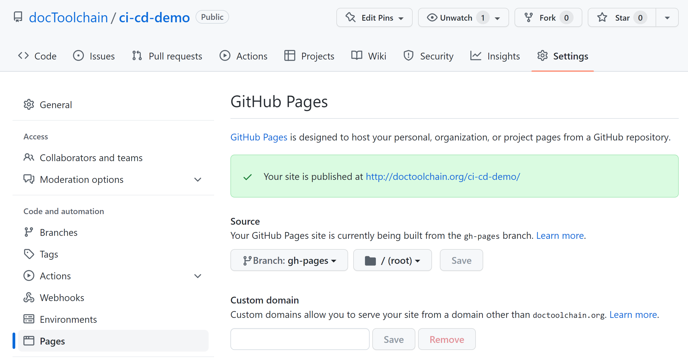

= CI-CD Demo

== Gitlab

This repository demonstrates how to use docToolchain within a gitlab CI/CD pipeline.

..gitlab-ci.yml
[source,yaml]
----
include::.gitlab-ci.yml[]
----

Just add the `.gitlab-ci.yml` file to the root of your project, and you're ready to go.

To find the URL for your new microsite, navigate to `Settings` > `Pages`.

== Github

...and within a Github Action workflow:

..github/workflows/gh-pages.yml
[source,yaml]
----
include::.github/workflows/gh-pages.yml[]
----

Add the file above to your project and and wait for the first run of the github action.
This will create a new branch called `gh-pages`.
It contains the HTML source of your microsite.

Now you have to tell github to deploy these sources to the server.
Got to `Settings`> `Pages` and set as Source the `gh-pages` branch.

Now wait until the deployment is finished.
The URL for your microsite is displayed in the green box of the settings page.

http://doctoolchain.org/ci-cd-demo/
